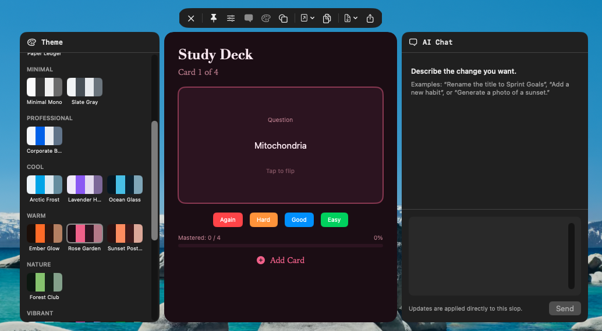
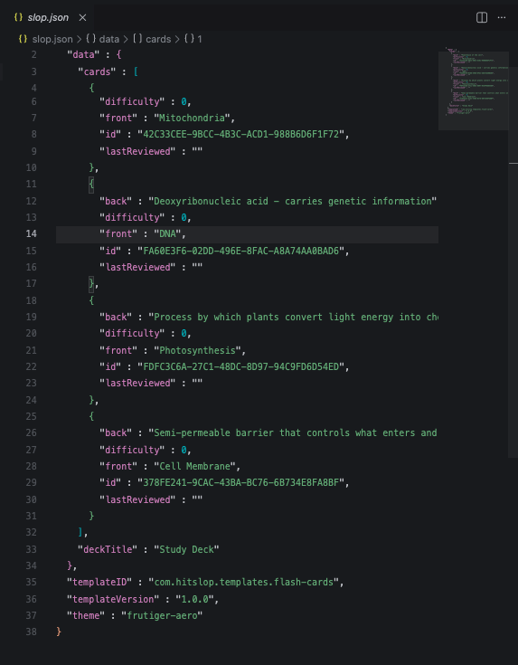
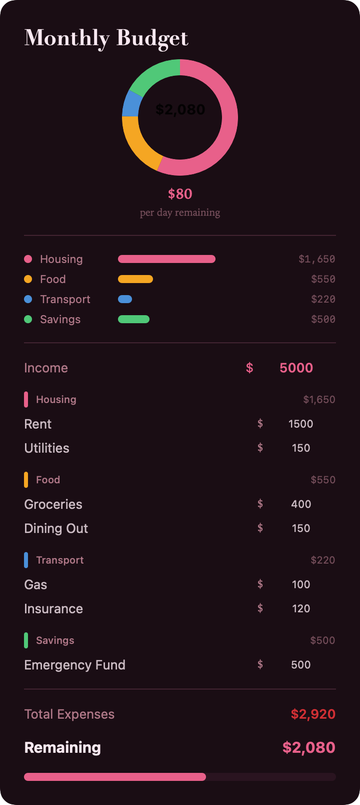
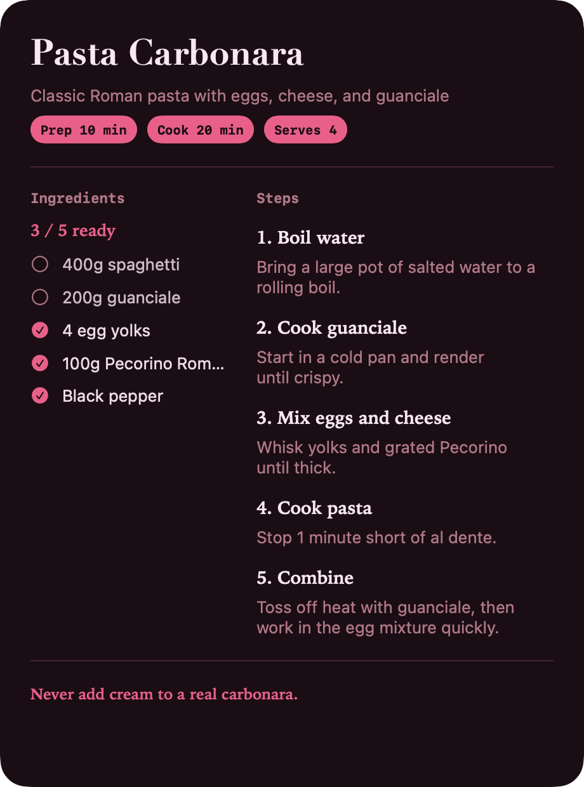
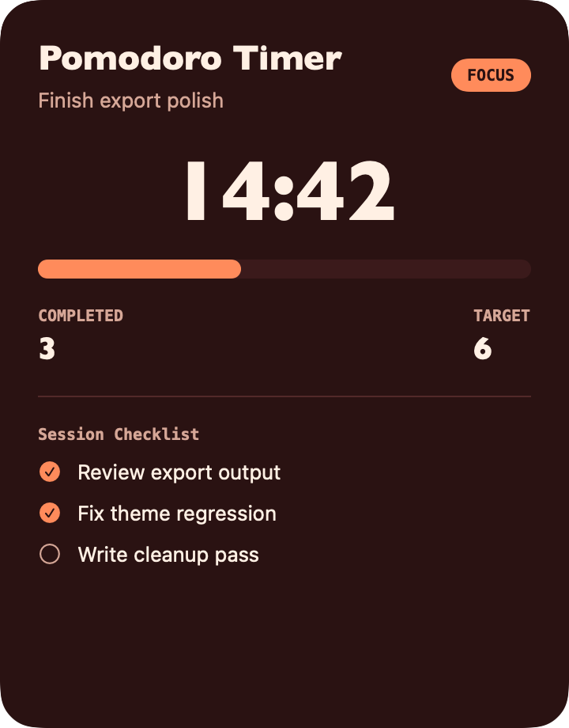
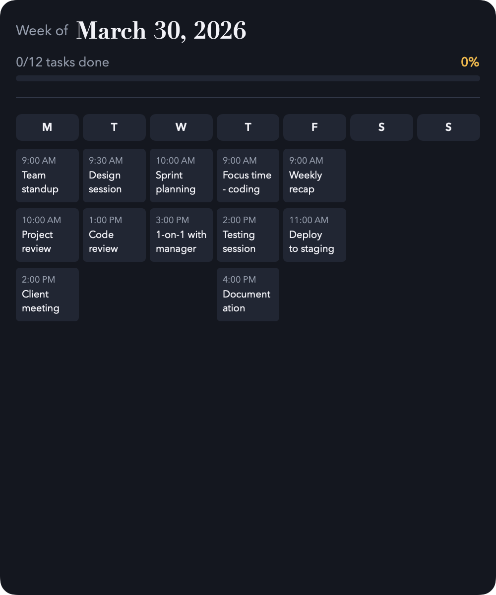
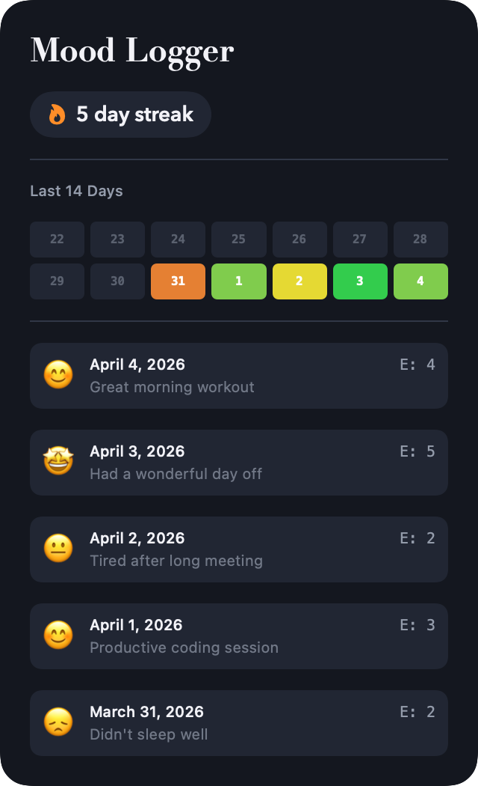
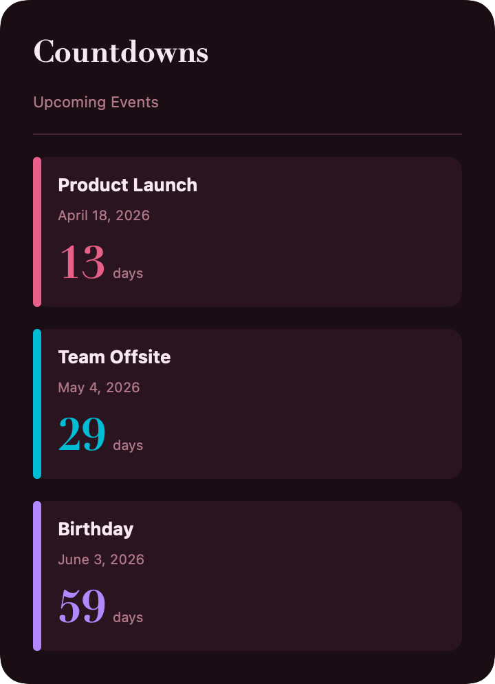
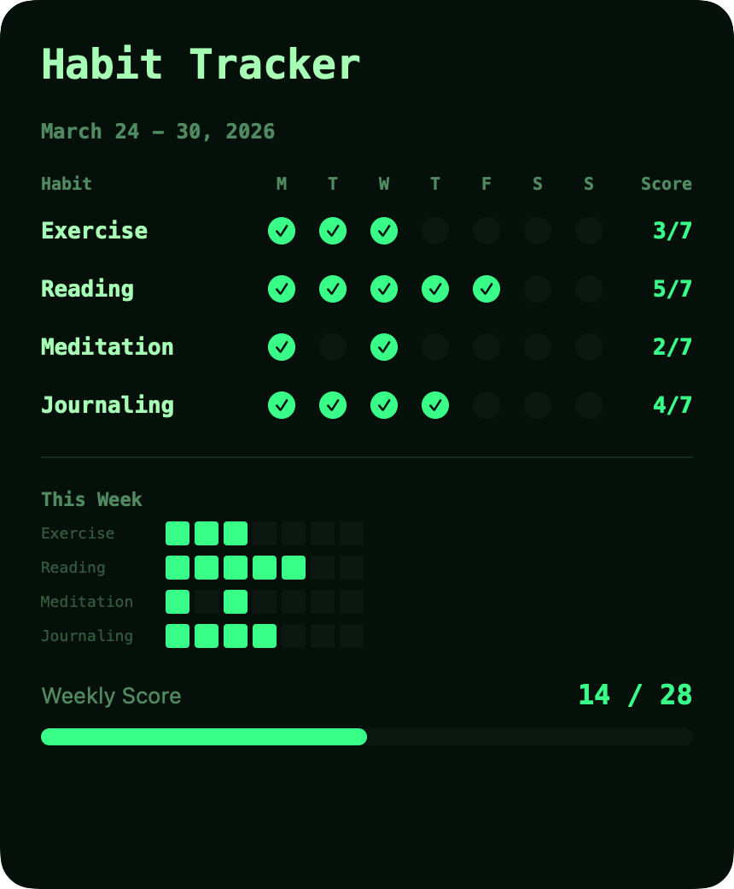
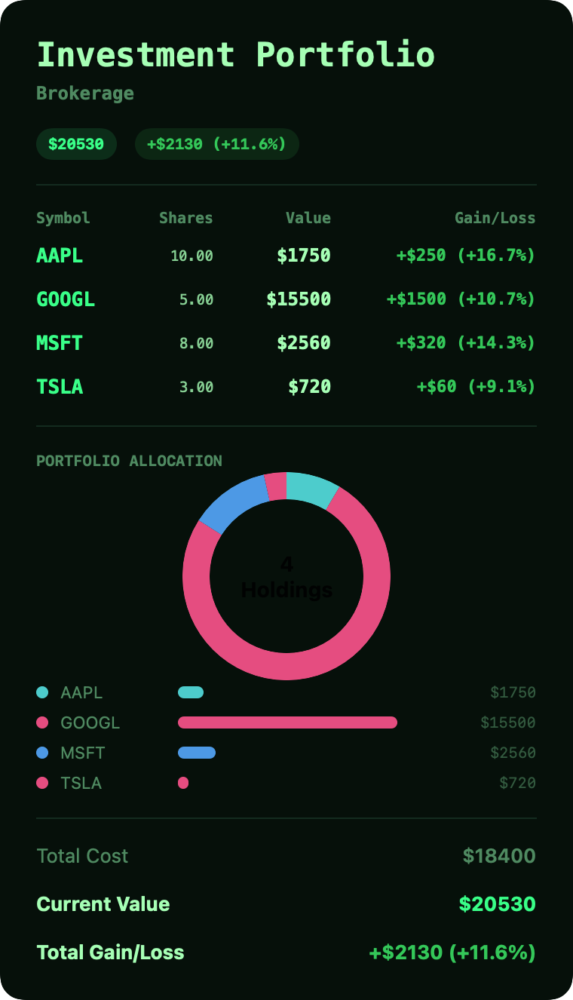

# hitSlop

[](https://discord.gg/cqKRZjAWv3)

**Interactive documents your AI can read, edit, and understand — and so can you.**

Plain text. Complete context. Zero lock-in

<div align="center">
<table><tr>
<td></td>
<td></td>
</tr></table>
</div>

---

## The Problem

Apps lock you in. Documents lock you out of interactivity.

Your budget app stores your data in a proprietary database. Your AI assistant can't read it, can't edit it, can't help you make sense of it. You're locked into one ecosystem, one interface, one company's roadmap.

Meanwhile, plain text documents are open but static. Your notes app gives you freedom but no interactivity. You can't have both.

Or can you?

---

## The Solution

hitSlop gives you **fun, interactive documents powered by plain text**.

`.slop` files are packages — bundles containing `slop.json` plus optional theme overrides and assets. Shareable containers your AI can read, your text editor can open, and hitSlop renders as beautiful, themed, interactive applications.

### Bidirectional Editing

**Edit the UI, the file updates. Edit the file, the UI updates.**

- Change a value in the rendered document → synced to disk instantly
- Edit the JSON in your text editor → UI updates in real time
- Your AI modifies the file → you see the changes immediately
- You modify the file → your AI sees your changes immediately

**Your AI edits, you see it. You edit, your AI sees it. Same file. Same truth.**

This is what human-AI collaboration looks like: one document, one source of truth, accessible to both of you.

---

## Why This Matters

I built this because the more I use Claude Code, the more I want everything to be controllable by it. I should be able to do my taxes, fill out forms, control my budget, and everything in between.

When your data lives in proprietary formats, your AI is blind to it. It can't help you track your budget, organize your recipes, plan your week — because it can't see or touch the data that matters to you.

hitSlop changes that:

- **No lock-in** — `.slop` packages are readable JSON bundles. Open them in any editor, process them with any tool, read them with any AI.
- **Complete context** — Your document is self-contained. Everything your AI needs is right there: the template reference, your data, your theme preferences, your assets.
- **Edit from anywhere** — hitSlop, VS Code, vim, or your AI assistant. Same file, same capabilities.
- **Export anytime** — Generate PDFs or images with one click. Your data, your format.

**Your tools shape how you think.** Don't let proprietary apps shape your thinking. Use tools that respect your freedom.

---

## What You Can Make

70+ templates across personal, work, finance, health, learning, creative, and more. Each one a starting point, not a constraint.

<div align="center">








</div>

**Not generic.** Each template has personality — themed windows, custom shapes, thoughtful interactions.

---

## How It Works

Three pieces, all plain text, all yours:

**Templates** — SwiftUI views (or Lua scripts) that define how your document looks and behaves. Reference them by name from your `.slop` file.

**Themes** — 22 built-in visual styles, or create your own at runtime. Dark, light, vibrant, minimal — each with semantic colors, typography, and spacing.

**Documents** — Interactive `.slop` packages containing `slop.json` with your template reference, data, and preferences. Assets like images live alongside. Everything together, everything portable.

```json
{
  "template": "budget-tracker",
  "theme": "studio-noir",
  "data": {
    "income": 5000,
    "expenses": [
      { "name": "Rent", "amount": 1500 },
      { "name": "Groceries", "amount": 400 }
    ]
  }
}
```

Your AI reads this. You read this. Any tool reads this.

---

## Get Started

### Clone and Build

```bash
# Clone repository
git clone https://github.com/longtail-labs/hitSlop.git
cd hitslop

# Open in Xcode
open hitSlop/hitSlop.xcodeproj

# Build and run (Cmd+R)
```

### Requirements

- **macOS 14.0+** (Sonoma or later)
- **Xcode 16+**
- **Swift 6.0+**

---

## Template Gallery

### Personal

- Todo List
- Daily Planner
- Weekly Planner
- Weekly Review
- Brain Dump
- Simple Note
- Sticky Notes
- Gratitude Journal
- Decision Journal
- Goal Tracker
- Countdown

### Work

- Meeting Notes
- Team Standup
- Project Tracker
- OKR Tracker
- Kanban
- Invoice
- Prompt Lab

### Finance

- Budget Tracker
- Expense Tracker
- Net Worth
- Investment Portfolio
- Portfolio Allocator
- Debt Payoff Planner
- Tax Optimizer
- Side Hustle Tracker
- Subscription Tracker
- Financial Goals Simulator
- FIRE Calculator
- Loan Calculator

### Health

- Habit Tracker
- Mood Logger
- Fitness Log
- Workout Planner
- Water Intake
- Sleep Tracker
- Symptom Tracker
- Medication Schedule

### Learning

- Study Timer
- Flash Cards
- Grade Tracker
- Class Schedule
- Reading List

### Creative

- Recipe
- Meal Planner
- Color Palette
- Resume
- Writing Tracker
- Slide
- Markdown Editor
- Spreadsheet
- Daily Quote
- Media Review
- Content Review Board

### AI Content

- AI Gallery
- App Store Screenshot
- Social Post Preview

### Media

- Watch List
- World Clock
- Unit Converter

### Legal

- NDA
- Service Agreement
- Contractor Agreement
- Lease Agreement
- Estate Will

### Travel

- Trip Planner
- Packing List

### Events

- Party Planner
- Wedding Planner

### Home

- Home Inventory
- Cleaning Schedule
- Contact CRM

---

## For Developers

### Architecture

- **`hitSlop/`** — Main macOS app (thin Xcode shell)
- **`Packages/SlopCore/`** — Core SPM package
  - `SlopUI` — Host-side UI and document management
  - `SlopAI` — AI integration (Firebase)
- **`Packages/SlopKit/`** — Template authoring framework
- **`Packages/SlopTemplates/`** — 70+ built-in templates

### Create Custom Templates

**Option 1: SwiftUI (compiled)**

```swift
import SlopKit

@Record
struct MyData {
  @Field var title: String = "Untitled"
  @Field var items: [Item] = []
}

@SlopTemplate(
  name: "My Template",
  category: .personal,
  icon: "✨"
)
struct MyView: View {
  @TemplateData var data: MyData
  
  var body: some View {
    // Your SwiftUI view
  }
}
```

Build as a dynamic framework, drop in `~/.hitslop/templates/`, and it appears in hitSlop. Submit a PR to add your template to the built-in collection.

**Option 2: Lua (runtime)**

We're building a Lua templating system for creating layouts at runtime — no compilation required. Define schemas, layouts, and actions in pure Lua:

```lua
function template.schema()
    return {
        sections = {{
            title = "Counter",
            fields = {
                { key = "count", label = "Count", kind = "number", defaultValue = 0 },
            }
        }}
    }
end

function template.layout(data, theme, context)
    return VStack(16, {
        Text(tostring(data.count), { font = "largeTitle" }),
        Button("Increment", "inc"),
    })
end

function template.onAction(name, data)
    if name == "inc" then data.count = data.count + 1 end
    return data
end
```

### IPC and CLI

hitSlop supports JSON-RPC 2.0 over Unix socket:

```bash
# Open a slop document
slop open ~/Documents/budget.slop

# List open documents
slop list

# Get capabilities
slop system.capabilities
```

### Themes

Create custom themes at runtime. Drop a `.theme` file in `~/.hitslop/themes/`:

```json
{
  "name": "My Theme",
  "colors": {
    "background": "#1a1a2e",
    "foreground": "#eaeaea",
    "accent": "#ff6b6b"
  }
}
```

---

## Contributing

Contributions welcome.

1. Fork the repository
2. Create a feature branch
3. Make your changes
4. Submit a pull request

**Code style:** Swift conventions, composition over inheritance, explain "why" not "what".

---

## Inspiration

- **[HyperCard (1987)](https://en.wikipedia.org/wiki/HyperCard)** — *"The best program ever written."* The original dream of empowering non-programmers to build software.
- **[HyperClay](https://hyperclay.com)** — Malleable HTML files where UI, logic, and data live in one shapeable thing.
- **[Potluck (Ink & Switch)](https://www.inkandswitch.com/potluck/)** — Gradual enrichment from docs to apps.
- **[Liber Indigo](https://www.youtube.com/watch?v=GM91kAh_V-U)** — *"We shape our tools and thereafter our tools shape us."*

---

## License

MIT

---

**Your AI can edit your interactive document while you watch. You can edit it while your AI watches. Same file. Same truth.**
